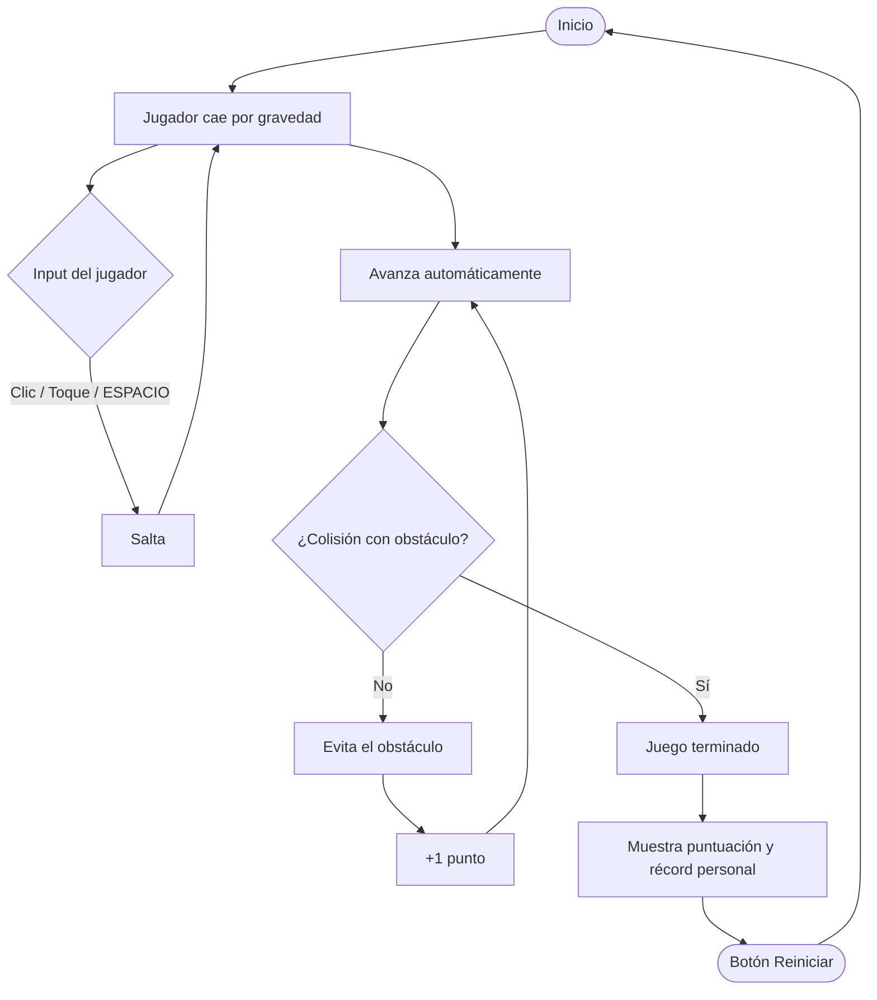
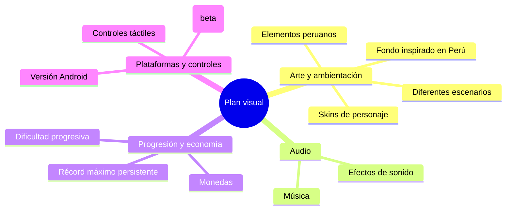

# Estructura visual del juego
## Runner vertical con temática peruana — Godot 4.x

> **Título:** *Pechuga en fuga*
> **Género:** Endless runner / esquiva de obstáculos
> **Motor:** Godot 4.x
> **Estado:** Diseño / pre-producción

---

## 1. Resumen del proyecto

Juego 2D casual de sesiones cortas en el que el personaje cae constantemente por efecto de la gravedad y avanza de forma automática. El jugador debe pulsar **clic, ESPACIO o tocar la pantalla** para saltar y esquivar los obstáculos que se desplazan hacia la izquierda. Cada obstáculo superado suma un punto; el juego termina al colisionar. Su rasgo distintivo frente a otros juegos del mismo género será la **identidad visual y cultural peruana** (fondos, personajes y elementos temáticos). La idea es básicamente un pollo que huye para que no lo conviertan en pollo a la brasa.

---

## 2. Concepto central: loop de juego

El ciclo de juego se puede representar como el siguiente flujo:

**Lectura del loop:** el jugador nunca deja de caer ni de avanzar; su única acción es *saltar en el momento correcto*. La dificultad nace de la frecuencia y disposición de los obstáculos, no de controles complejos, lo cual encaja bien con partidas cortas y rejugables.

---

## 3. Especificaciones técnicas

| Aspecto | Detalle |
|---|---|
| Motor | Godot 4.x |
| Tipo de juego | 2D — esquiva de obstáculos / endless runner |
| Resolución base | 480 × 854 px |
| Orientación | Vertical (retrato) |
| Entradas soportadas | Clic, tecla ESPACIO, toque táctil |
| Plataforma inicial | PC / escritorio |
| Plataformas futuras | Android |
| Persistencia | Récord guardado localmente |

---

## 4. Mecánicas principales

| Mecánica | Descripción |
|---|---|
| Caída por gravedad | El personaje desciende de forma constante. |
| Salto | Clic, ESPACIO o toque impulsan al personaje hacia arriba. |
| Movimiento de obstáculos | Los obstáculos se desplazan de derecha a izquierda. |
| Generación de obstáculos | Aparecen de forma automática y continua. |
| Detección de colisiones | Se identifica el contacto entre personaje y obstáculo. |
| Sistema de puntuación | +1 punto por cada obstáculo superado. |
| Game Over | Se activa al detectar una colisión. |
| Reinicio | Botón para volver a intentar la partida. |
| Récord local | Guarda el mejor puntaje alcanzado en el dispositivo. |

---

## 5. Checklist de construcción base en Godot

- [x] Personaje que cae por gravedad
- [x] Input de salto (ESPACIO / clic / toque)
- [x] Obstáculos con movimiento hacia la izquierda
- [ ] Generador automático de obstáculos
- [ ] Sistema de detección de colisiones
- [ ] Sistema de puntuación en pantalla
- [ ] Pantalla de Game Over
- [ ] Botón de reinicio
- [ ] Guardado local del récord (por ejemplo, con `FileAccess` o `ConfigFile`)

---

## 6. Identidad visual: elementos peruanos sugeridos

Para dar sentido a la temática planteada (al llegar a determinado puntaje, puesto que de inicio será un horno):

| Elemento cultural | Posible uso en el juego |
|---|---|
| Andes / Machu Picchu | Fondo principal o escenario base |
| Cóndor andino | Obstáculo aéreo o power-up de bonificación |
| Chullo y textiles andinos | Skin del personaje o detalles de interfaz |
| Llama / alpaca | Personaje jugable alternativo (skin) |
| Líneas de Nazca | Escenario alternativo tipo desierto costero |
| Gastronomía | Ítem coleccionable estilo "moneda" |
| Música andina / marinera | Banda sonora temática del juego |

---

## 7. Roadmap de expansión — (o Cosas para agregar)

### Priorización a la que me dedicaré actualmente

| Elemento a agregar | Categoría | Prioridad | Complejidad estimada |
|---|---|---|---|
| Récord máximo persistente | Progresión | Alta | Baja |
| Música y efectos de sonido | Audio | Alta | Baja–Media |
| Fondo inspirado en Perú | Arte | Alta | Media |
| Elementos peruanos (iconografía) | Arte | Alta | Media |
| Controles táctiles | Plataformas | Media | Baja |
| Dificultad progresiva | Progresión | Media | Media |
| Monedas | Progresión | Media | Media |
| Diferentes escenarios | Arte | Media | Alta |
| Skins de personaje | Arte / Progresión | Baja | Media |
| Versión Android | Plataformas | Baja (post-MVP) | Alta |
| Versión PC | Plataformas | Ya contemplada en el MVP | — |

*(La prioridad y complejidad son estimaciones orientativas para planificar el desarrollo; pueden ajustarse según mis tiempos y los recursos disponibles.)*

---

## 8. Fases de desarrollo

1. **Fase 1 — MVP funcional:** implementar el loop base (gravedad, salto, obstáculos, colisiones, puntuación, Game Over, reinicio, récord local) sin arte definitivo.
2. **Fase 2 — Identidad visual:** incorporar el fondo peruano y los primeros elementos gráficos temáticos.
3. **Fase 3 — Audio y progresión:** añadir música, efectos, monedas, dificultad progresiva y récord persistente pulido.
4. **Fase 4 — Multiplataforma:** controles táctiles, build para Android y pulido final de la versión PC.

---

## 9. Próximos pasos

- Definir el nombre final del juego.
- Prototipar el loop base en Godot antes de invertir en arte.
- Reunir referencias visuales peruanas concretas (paletas de color, íconos, silueta de escenarios).
- Validar la jugabilidad con partidas de prueba antes de sumar contenido de las fases 2–4.
